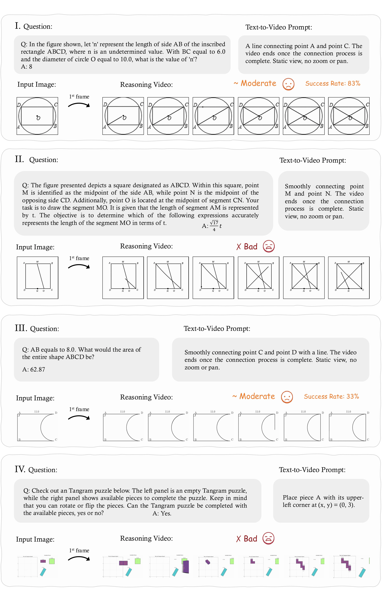
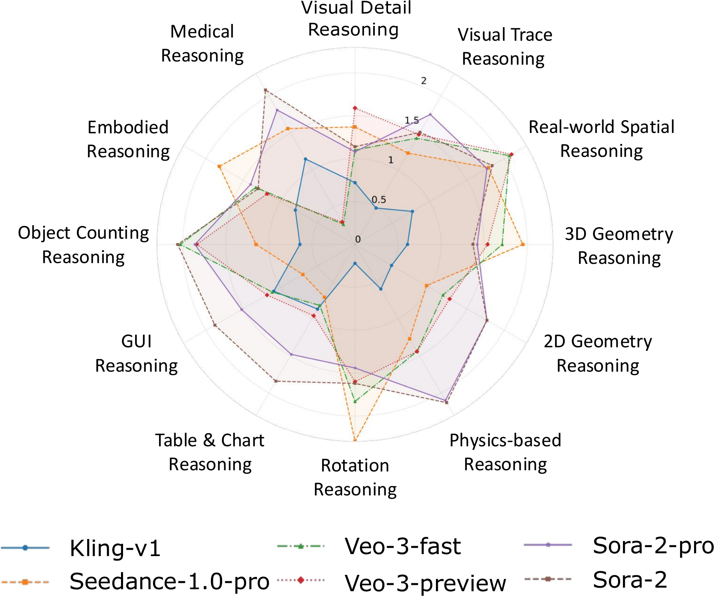
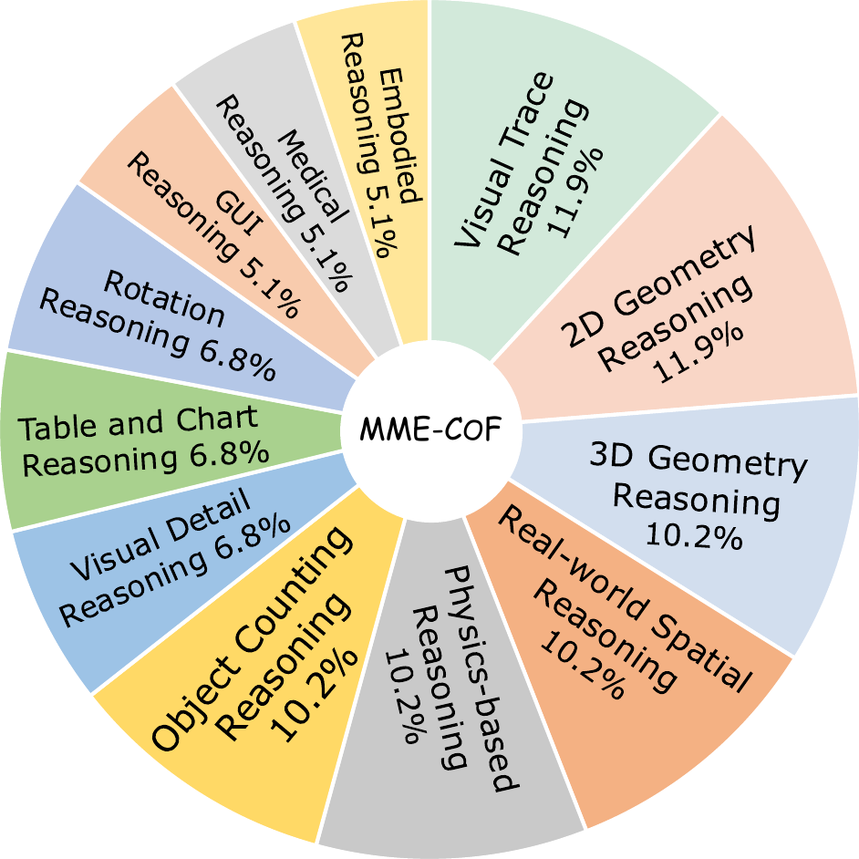
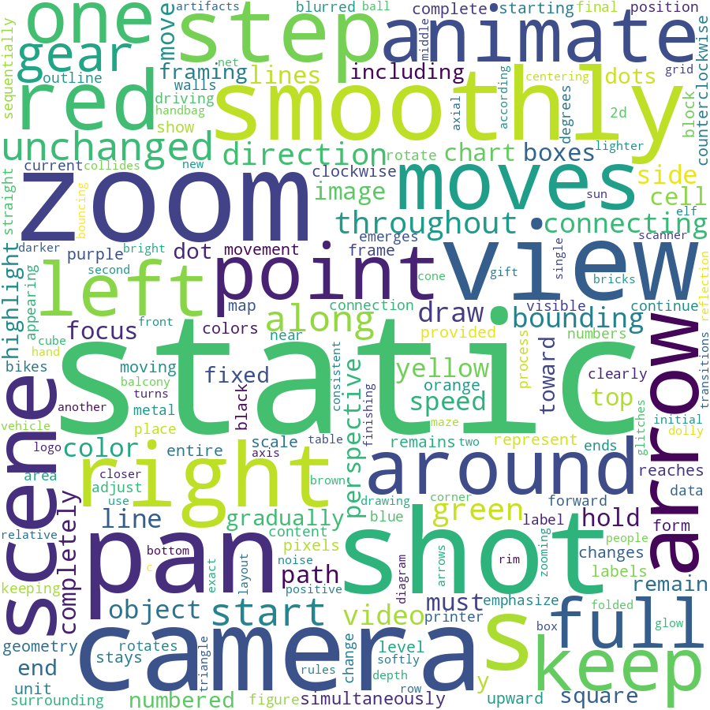

# MME-CoF: Evaluation of Video Chain-of-frames 🎬

Official repository for the project "[Are Video Models Ready as Zero-Shot Reasoners? An Empirical Study with the MME-COF Benchmark](https://arxiv.org/pdf/2510.26802)"

[🌍 [Homepage](https://video-cof.github.io/)] [📖 [arXiv Paper](https://arxiv.org/pdf/2510.26802)] [🤗 [HF Datasets](https://huggingface.co/datasets/ZiyuG/MME-CoF)]


## 💥 News
- **[2025.11.03]** 🔥 We release the [evaluation code](https://github.com/ZiyuGuo99/MME-CoF?tab=readme-ov-file#evaluation).
- **[2025.11.03]** 🔥 We publish MME-CoF benchmark data at [[🤗 Huggingface Dataset]](https://huggingface.co/datasets/ZiyuG/MME-CoF).
- **[2025.11.01]** 🚀 We release the [arXiv paper](https://arxiv.org/pdf/2510.26802).


## 🧠 Study Overview

<p align="center">
  
</p>

<p align="center"><em>Overview of Our Study on the Reasoning Potential of Video Models.</em></p>

We investigate a key question: ***Are current video models reliable zero-shot reasoners?*** While modern video models can “see the world” and show promising ability to perceive, understand, and manipulate complex visual scenes, their **actual reliability in visual reasoning** remains unverified.

We conduct a comprehensive Chain-of-Frame (CoF) evaluation of the leading model Veo-3 across 12 core dimensions and introduce MME-CoF, a compact and standardized benchmark for systematic CoF reasoning assessment. Our findings show that current video models are **not yet** dependable standalone zero-shot reasoners, but they demonstrate strong potential as powerful visual perception and scene-understanding modules to complement dedicated reasoning systems.

## 🔍 Deep-Dive Analysis on Veo-3

We provide the *first* investigation of video models (Veo-3) to analyze their visual reasoning potential, detailing representative successes, characteristic errors, and the conditions under which CoF reasoning emerges, holds, or breaks.

<p align="center">
  
</p>


## 💪 Evaluation

### Download Dataset

```bash
git lfs install
git clone https://huggingface.co/datasets/ZiyuG/MME-CoF
```

### Run Evaluation

By default, each image is padded to 16:9, and the video model generates **six videos per image**. We evaluate using **gemini-2.5-pro**.

1. Place `evaluate.py` and `genai_client.py` under the dataset folder  
2. Edit **line 24** in `genai_client.py` to add your Google AI API Key  
3. Run: `python evaluate.py`  

Results will be saved to `mme-cof_eval_results.json`


## 📦 MME-CoF Benchmark

We curate MME-CoF, a compact benchmark providing a standardized taxonomy and an evaluation protocol aligned with CoF reasoning, enabling consistent and category-wise assessment beyond surface-level visual fidelity.


<p align="center">
  
  
  &nbsp;&nbsp;&nbsp;&nbsp;
  
</p>

<p align="center"><em>Evaluation Radar Map, Category Distribution, and Word Cloud of MME-CoF.</em></p>


## 📜 Citation

If you find this work useful, please cite:

```bibtex
@article{guo2025mme-cof,
  title={Are Video Models Ready as Zero-Shot Reasoners? An Empirical Study with the MME-COF Benchmark},
  author={Guo, Ziyu and Chen, Xinyan and Zhang, Renrui and An, Ruichuan and Qi, Yu and Jiang, Dongzhi and Li, Xiangtai and Zhang, Manyuan and Li, Hongsheng and Heng, Pheng-Ann},
  journal={arXiv preprint arXiv:2510.26802},
  year={2025}
}

```
