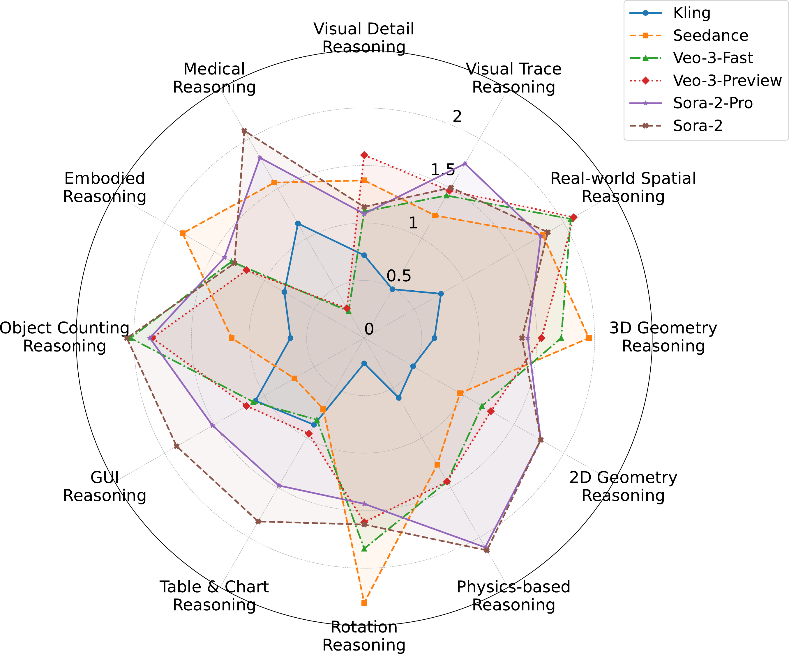
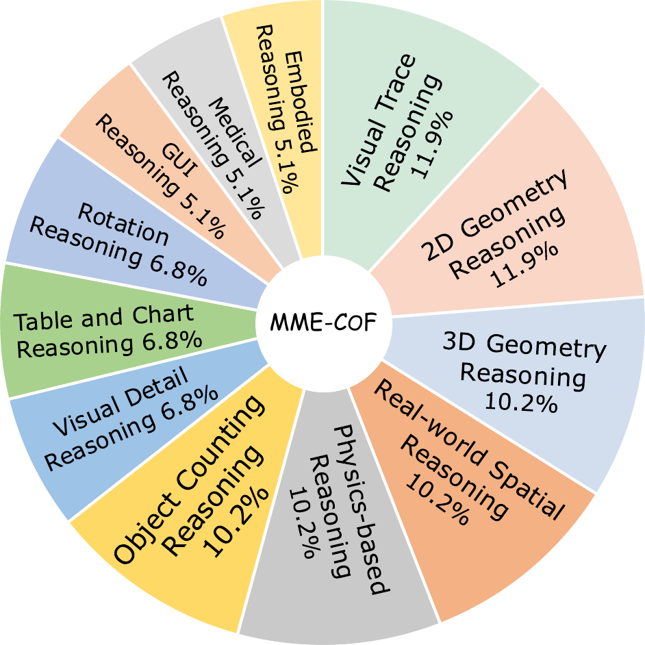
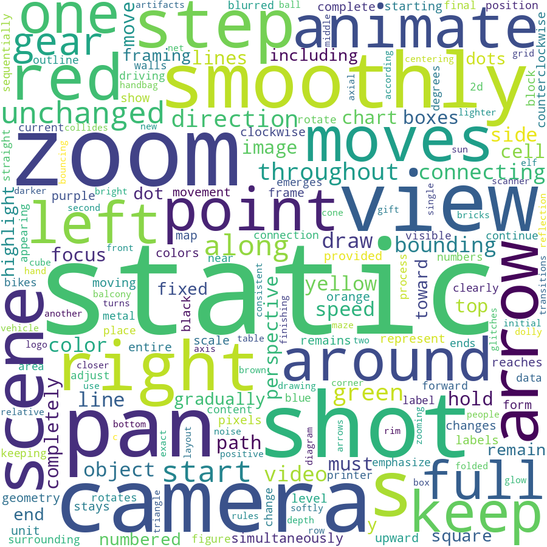

# MME-CoF: Evaluation of Video Chain-of-frames 🎬

Official repository for the project "[Are Video Models Ready as Zero-Shot Reasoners? An Empirical Study with the MME-COF Benchmark](https://arxiv.org/pdf/2510.26802)"

[🌍 [Homepage](https://video-cof.github.io/)] [📖 [arXiv Paper](https://arxiv.org/pdf/2510.26802)] [🤗 [HF Datasets](https://video-cof.github.io/)]

Benchmark dataset and evaluation code will be released soon.

## 🧠 Study Overview

<p align="center">
  
</p>

<p align="center"><em>Overview of Our Study on the Reasoning Potential of Video Models.</em></p>

## 📦 MME-CoF Benchmark

We curate MME-CoF, a compact benchmark providing a standardized taxonomy and an evaluation protocol aligned with CoF reasoning, enabling consistent and category-wise assessment beyond surface-level visual fidelity.


<p align="center">
  
  
  &nbsp;&nbsp;&nbsp;&nbsp;
  
</p>


## 📜 Citation

If you find this work useful, please cite:

```bibtex
@article{guo2025mme-cof,
  title={Are Video Models Ready as Zero-Shot Reasoners? An Empirical Study with the MME-COF Benchmark},
  author={Guo, Ziyu and Chen, Xinyan and Zhang, Renrui and An, Ruichuan and Qi, Yu and Jiang, Dongzhi and Li, Xiangtai and Zhang, Manyuan and Li, Hongsheng and Heng, Pheng-Ann},
  journal={arXiv preprint arXiv:2510.26802},
  year={2025}
}

```
